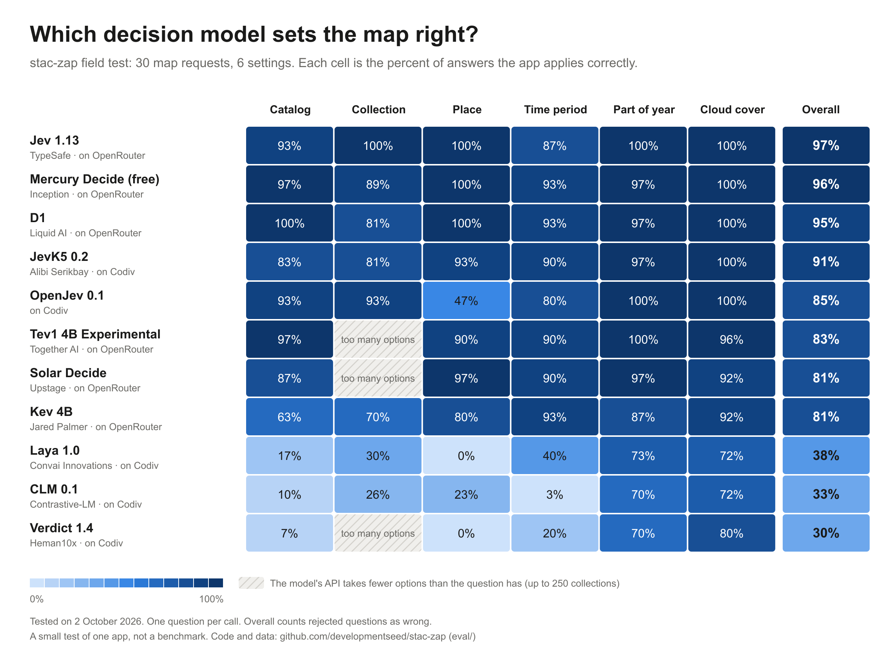

# Decision models for stac-zap

Tested on 2 October 2026.

stac-zap uses a decision model to turn a short request, for example "Landsat
over Denver in July 2024", into map settings. A decision model does not write
text. It gets a text and a set of questions with fixed options. It returns one
option per question and a probability for each option. stac-zap uses
[Jev 1.13](https://typesafe.ai/blog/introducing-system-one-models-and-jev) by
TypeSafe on OpenRouter.

Many new decision models became available in September 2026. This document
compares 11 of them on the questions that stac-zap asks. The scripts and the
raw results are in [eval/](../eval/README.md).

## Summary

- **Jev 1.13 gives the best results for stac-zap.** It is correct on 166 of
  172 questions. It is the only model that selects the correct collection for
  all prompts. This question has the most options, up to 250.
- **Mercury Decide (Inception) and D1 (Liquid AI) are almost as good** on the
  field test: 165 and 164 of 172. They are less accurate on collections and
  on world knowledge.
- **Most open models on Codiv are not yet usable for stac-zap.** JevK5 0.2 is
  the best of them (156 of 172), but it is slow (about 900 ms for each call).
- **Jev 1.13 is also the fastest of the accurate models.** A call takes
  about 300 ms, and the time almost does not increase with the number of
  options. See [Latency](#latency).
- **Some models cannot answer the large questions.** Tev1, Solar Decide and
  Verdict accept at most 20 to 26 options. Respan accepts only yes or no
  questions.
- **The test found a problem in stac-zap.** The app added a cloud cover
  filter that the user did not ask for. A new question text corrects this
  problem. See [Cloud cover](#cloud-cover).

## The models

| Model | Maker | Where | Limit |
|---|---|---|---|
| Jev 1.13 (`typesafe/jev-1.13`) | TypeSafe | OpenRouter | |
| Mercury Decide (`inception/mercury-decide:free`) | Inception | OpenRouter | Free version only: 20 requests per minute |
| D1 (`liquid/d1`) | Liquid AI | OpenRouter | |
| Kev 4B (`jaredpalmer/kev-4b`) | Jared Palmer | OpenRouter | |
| Tev1 4B Experimental (`togethercomputer/tev1-4b-experimental`) | Together AI | OpenRouter | 2 to 20 options |
| Solar Decide (`upstage/solar-decide`) | Upstage | OpenRouter | 26 options |
| Span-01 and Span-01 Lite (`respan/...`) | Respan | OpenRouter | Yes or no questions only |
| OpenJev 0.1 (`openjev-latest`) | | Codiv | |
| JevK5 0.2 (`jevk5-0.2`) | Alibi Serikbay | Codiv | |
| CLM 0.1 (`clm-v0.1`) | Contrastive-LM | Codiv | |
| Laya 1.0 (`laya-1.0`) | Convai Innovations | Codiv | |
| Verdict 1.4 (`verdict-1.4`) | Heman10x | Codiv | 24 options |

The Respan models can not answer the questions of stac-zap. They are not in
the results.

## Test 1: the field test

### Procedure

For each request, stac-zap asks these questions:

1. The catalog: one of 13 STAC catalogs.
2. The collection: one of the collections of the catalog, up to 250.
3. The place: the words of the request that name the place, "the map view",
   or "no place".
4. The time period: a year from 2015 to 2026, the last 30 days, the last 12
   months, or all dates.
5. The part of the year: a season, a month, or the whole year.
6. The maximum cloud cover: from 5% to 75%, or no filter.

The test has 30 requests. A person wrote the correct answers for each
request. Some requests have more than one correct answer. The test does not
score a question when no answer is clearly correct.

The test uses the code of the app to make the questions. Thus, each model
gets the same text as in the app. The test then scores each answer as the
app applies it. For example, the app does not change the time period when
the probability of the answer is less than 0.35. The test does the same.

Each question goes in a separate call. Thus, a model that cannot answer a
large question can still answer the small questions. The app asks
questions 2 to 6 in one call.

### Results

Each cell gives the number of correct answers. "Rejected" is the number of
questions that the API of the model did not accept.

| Model | Catalog | Collection | Place | Time period | Part of year | Cloud cover | Total | Median time |
|---|---|---|---|---|---|---|---|---|
| Jev 1.13 | 28/30 | **27/27** | 30/30 | 26/30 | 30/30 | 25/25 | **166/172** | 307 ms |
| Mercury Decide | 29/30 | 24/27 | 30/30 | 28/30 | 29/30 | 25/25 | 165/172 | 424 ms |
| D1 | **30/30** | 22/27 | 30/30 | 28/30 | 29/30 | 25/25 | 164/172 | 309 ms |
| JevK5 0.2 | 25/30 | 22/27 | 28/30 | 27/30 | 29/30 | 25/25 | 156/172 | 884 ms |
| OpenJev 0.1 | 28/30 | 25/27 | 14/30 | 24/30 | 30/30 | 25/25 | 146/172 | 867 ms |
| Tev1 4B | 29/30 | 5/27 (22 rejected) | 27/30 (1 rejected) | 27/30 | 30/30 | 24/25 | 142/172 | 247 ms |
| Solar Decide | 26/30 | 6/27 (21 rejected) | 29/30 (1 rejected) | 27/30 | 29/30 | 23/25 | 140/172 | 1075 ms |
| Kev 4B | 19/30 | 19/27 (1 rejected) | 24/30 | 28/30 | 26/30 | 23/25 | 139/172 | 574 ms |
| Laya 1.0 | 5/30 | 8/27 | 0/30 | 12/30 | 22/30 | 18/25 | 65/172 | 664 ms |
| CLM 0.1 | 3/30 | 7/27 | 7/30 | 1/30 | 21/30 | 18/25 | 57/172 | 679 ms |
| Verdict 1.4 | 2/30 | 2/27 (21 rejected) | 0/30 (1 rejected) | 6/30 | 21/30 | 20/25 | 51/172 | 660 ms |

The cost of one full run (172 calls) is less than $0.02 for each model.

### What the results show

- **The collection question shows the largest differences.** It has the
  most options. Jev 1.13 is correct on all 27 prompts. The next best models
  are correct on 22 to 25.
- **Jev 1.13 selects the wrong catalog for two prompts.** It sends "Sentinel-2
  Level-1C over Rome" and "wildfires in Los Angeles in January 2025" to
  Planetary Computer. The correct catalogs are Earth Search and eoAPI. D1 is
  correct on all 30 prompts.
- **OpenJev 0.1 finds the place in only 14 of 30 prompts,** but it is good on
  the other questions.
- **A model that always selects "keep" gets a high score on some
  questions.** For example, Laya 1.0 and CLM 0.1 get 18 of 25 on cloud cover.
  But they are correct on none of the 7 prompts that ask for a cloud cover.
  The script `eval/summary.ts` shows these two types of prompt separately.

### Cloud cover

The first run of the test found a problem in stac-zap. The app added a cloud
cover filter to requests that do not mention clouds.

For example, for "Landsat over Denver in July 2024", Jev 1.13 did not select
"keep". It gave a probability of about 0.2 to each of several maximum values.
The app uses the median of these values, so it applied a maximum of 15%.

The cause was the question text. The text told the model to select "keep"
only if the request "has nothing to do with" cloud cover. The model reads a
request for optical imagery as a request about clouds.

The new question text is:

> Which maximum cloud cover does the request ask for? Only a request that
> mentions clouds, cloud cover, a clear sky or cloud-free imagery asks for
> one.

The results before and after the change:

| Model | Cloud cover, old text | Cloud cover, new text |
|---|---|---|
| Jev 1.13 | 15/25 | 25/25 |
| Mercury Decide | 22/25 | 25/25 |
| D1 | 20/25 | 25/25 |
| JevK5 0.2 | 11/25 | 25/25 |
| Kev 4B | 10/25 | 23/25 |

The new text did not cause problems with indirect requests. Jev 1.13 still
applies a filter for "clear images of Paris", "sunny day imagery of Madrid"
and "Sentinel-2 of Lima, not too cloudy".

## Test 2: world knowledge

### Procedure

This test finds out if a model knows where a place is. stac-zap does not use
the model for this. It uses a geocoder. But a model that knows the world can
find places that a geocoder does not find, for example "flooding in Porto
Alegre".

The test has 38 places. For each place, the model selects a latitude band
and a longitude band. The test does two types of search:

- **100 bands:** one call with 100 latitude bands and 100 longitude bands.
- **Coarse to fine:** one call with bands of 10°. Then one call with 30
  smaller bands in and around the selected band.

The error is the distance from the true point to the middle of the selected
bands.

### Results

| Model | 100 bands: median error | Coarse to fine: median error | Error less than 100 km | Error less than 250 km |
|---|---|---|---|---|
| Jev 1.13 | 281 km | **110 km** | 18/38 | 22/38 |
| D1 | 552 km | 478 km | 3/38 | 14/38 |
| Mercury Decide | 770 km | 527 km | 2/38 | 7/38 |
| JevK5 0.2 | 4,436 km | 2,917 km | 0/38 | 0/38 |
| Kev 4B | 2,725 km | 3,212 km | 0/38 | 2/38 |
| OpenJev 0.1 | 5,592 km | 3,358 km | 0/38 | 0/38 |
| CLM 0.1 | 6,956 km | 7,054 km | 0/38 | 0/38 |
| Laya 1.0 | 12,089 km | 11,374 km | 0/38 | 0/38 |

Tev1 4B, Solar Decide and Verdict 1.4 did not accept 100 options.

Jev 1.13 knows the world much better than the other models. The open models
on Codiv often select a band on the wrong continent.

## Latency

### Procedure

The field test records the time of each call. The time starts when the
request leaves the computer and stops when the answer arrives. Thus, the
time includes the network. All calls went from one laptop in one run.

### Results

"p90" is the time that 90% of the calls do not exceed.

| Model | Median | p90 | Median, 30 options or fewer | Median, more than 100 options |
|---|---|---|---|---|
| Tev1 4B | 247 ms | 346 ms | 247 ms | Rejected |
| Jev 1.13 | 307 ms | 411 ms | 306 ms | **336 ms** |
| D1 | 309 ms | 457 ms | 306 ms | 461 ms |
| Mercury Decide | 424 ms | 814 ms | 399 ms | 939 ms |
| Kev 4B | 574 ms | 1,032 ms | 552 ms | 1,159 ms |
| Laya 1.0 | 664 ms | 739 ms | 659 ms | 729 ms |
| Verdict 1.4 | 660 ms | 759 ms | 660 ms | Rejected |
| CLM 0.1 | 679 ms | 801 ms | 670 ms | 709 ms |
| OpenJev 0.1 | 867 ms | 1,185 ms | 855 ms | 1,185 ms |
| JevK5 0.2 | 884 ms | 2,501 ms | 845 ms | 2,589 ms |
| Solar Decide | 1,075 ms | **12,871 ms** | 1,075 ms | Rejected |

### What the results show

- **The time of Jev 1.13 almost does not change with the size of the
  question.** A call takes 306 ms with 30 options or fewer, and 336 ms with
  more than 100 options. For D1, the time increases by half. For Mercury
  Decide, the time is more than two times longer. In stac-zap, the
  collection question has the most options, so this difference is
  important.
- **Jev 1.13 and D1 are equally fast on small questions,** at about 300 ms.
- **The models on Codiv take 0.7 to 0.9 s for each call.** On large
  questions, JevK5 0.2 takes about 2.6 s.
- **Solar Decide is not usable for an interactive app.** 10% of its calls
  took more than 12 s. The slowest call took 23 s.
- **Tev1 4B is the fastest model,** but it accepts at most 20 options.

stac-zap makes 2 or 3 calls for each request, one after the other. With
Jev 1.13, these calls take about 1 s in total. With a model on Codiv, they
take 2 to 3 s. The STAC searches and the map data take more time than the
model calls.

### Limits

- The times are from one run, from one computer, at one time of day.
- The Codiv calls had a pause of 1.1 s between them, because of the rate
  limit. Thus, the rate limit did not add time to a call.
- The test asks each question in a separate call. The app asks 5 questions
  in one call. Thus, the time for each request in the app can be different.

## Models that this document does not include

- **Nimble** by Bespoke Labs. This open model runs in Ollama 0.35 or later.
  There is no hosted version, and the free demo API needs credentials now.
  The Ollama version accepts at most 26 options. On a laptop without a GPU,
  a call took about 6 seconds.
- **Strands Decider 2B** by AWS. AWS released it on 1 October 2026 as an
  open model. We did not test it.
- **Amazon Bedrock** has no decision model. You can import an open model
  with Custom Model Import, but Bedrock does not supply the decision API.

## Limits of these tests

- The tests are small: 30 requests and 38 places. A difference of 1 to 3
  answers is not important.
- A person wrote the correct answers. Another person can disagree with some
  of them.
- The tests measure one app. They do not measure the general quality of a
  model.
- Each question goes in a separate call. The app asks 5 questions in one
  call. An earlier test with OpenJev found no difference between the two
  methods, but we did not test this for each model.
- The models change often. Many of these models are less than one month
  old.

## Do the tests again

Read [eval/README.md](../eval/README.md).
